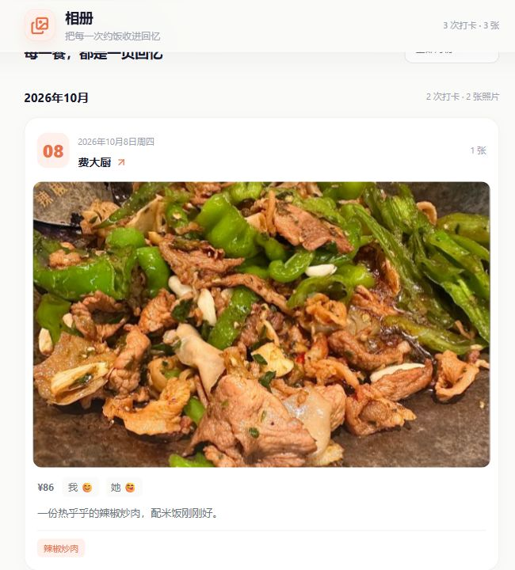

# TodaEat · 今天吃什么

**English | [简体中文](README.zh-CN.md)**

[](https://github.com/wangyuzz/TodaEat/actions/workflows/ci.yml)
[](https://github.com/wangyuzz/TodaEat/actions/workflows/packages.yml)
[](LICENSE)

A self-hosted restaurant wishlist and shared dining journal for two people. Save places you want to try, pick a restaurant when you cannot decide, and keep a record of meals, ratings, moods, and photos. Couples, friends, and anyone who enjoys sharing meals can run their own instance.

TodaEat uses React + Vite, Go + Gin, and SQLite. A single Go service serves the built frontend and API. Optional location search uses AMap; the core application works without an API key.

## Preview

| Home | Restaurant collection | Meal albums |
| --- | --- | --- |
|  |  |  |
| Pick a restaurant and quickly record a meal. | Search, filter by category, and save places to try. | Revisit each meal with images, moods, and spending. |

Screenshots use the frontend in a local preview with maintainer-supplied photos of Fei Da Chu, Burger King, and a dessert shop. Addresses, visit dates, spending, and notes are sample data. Fresh installations include these three example restaurants and dishes; the photos are bundled in `frontend/public/examples/`.

[Hosted instance](https://eat.nowayzzz1.dpdns.org/) requires an application password. The screenshot fixtures are separate from the hosted instance. The application interface is currently in Simplified Chinese; this repository provides English and Chinese documentation.

## Features

- **Restaurant collection:** organize categories, addresses, signature dishes, tags, images, and wishlists.
- **Random suggestions:** choose a restaurant from your collection when you cannot decide.
- **Shared meal check-ins:** record the date, dishes, both people's ratings and moods, cost, notes, and photos.
- **Dining memories:** browse visit history, statistics, and a photo wall with month filters and image previews.
- **Achievements:** unlock milestones from your dining history.
- **Administration:** manage dishes and records, clone dishes, apply batch changes, and customize the application name.
- **Image processing:** compress display images and retain backups of uploaded originals.
- **Access protection:** separate application and administrator passwords, administrator JWT sessions, and authenticated photo access.
- **Optional location search:** find restaurant locations through AMap.

The first startup initializes SQLite and installs example restaurants, menus, and achievements.

## Source history

This project continues the author's earlier application. Some frontend source was recovered from the author's own deployed build, then refactored and maintained; some modules retain recovered variable names and compatibility layers. Maintained application code lives in `frontend/src/` and `backend/`. Recovery tools, personal runtime data, and local toolchains are excluded from the published source.

The repository includes deployment instructions, contribution guidelines, backend tests, frontend photo-wall model tests, and continuous integration. Public commit dates reflect the actual source import and subsequent changes.

## Technology

| Area | Stack |
| --- | --- |
| Frontend | React 19, Vite 8, React Router |
| State and requests | TanStack Query, Zustand, Axios |
| Animation and icons | GSAP, Lucide |
| Backend | Go, Gin, GORM |
| Database | SQLite with a pure Go driver |
| Authentication | Application password, administrator JWT, photo session cookie |

## Quick start

### Requirements and configuration

Install Go 1.25.5 or later and Node.js 22.12 or later with npm. Use PowerShell on Windows or Bash on Linux / macOS. Clone the repository and enter its root directory.

For a new installation, copy the configuration template:

```powershell
# Windows PowerShell
Copy-Item .env.example backend/.env
```

```bash
# Linux / macOS
cp .env.example backend/.env
```

Edit `backend/.env` and set your own `APP_PASSWORD`, `ADMIN_PASSWORD`, and random `JWT_SECRET`. Passwords must contain at least 8 characters; the JWT key must contain at least 32 bytes. The service rejects missing required credentials and public placeholder values. Edit the current configuration when upgrading an existing installation.

Generate a random signing key:

```bash
node -e "console.log(require('node:crypto').randomBytes(32).toString('hex'))"
```

### Development

Start the backend in one terminal:

```bash
cd backend
go mod download
go run ./cmd/server
```

Start the frontend from the repository root in another terminal:

```bash
cd frontend
npm ci
npm run dev
```

Open [http://127.0.0.1:5173](http://127.0.0.1:5173) and enter your application password. Vite proxies `/api` and `/uploads` to `http://127.0.0.1:8080`; update `frontend/vite.config.js` if you change the backend port.

### Combined application on Windows

After configuration, run from the repository root:

```powershell
./scripts/build.ps1
./scripts/start-local.ps1
```

Open [http://127.0.0.1:8080](http://127.0.0.1:8080). The startup script uses `backend/.env`; default data and image directories are under `backend/`. Stop with `Ctrl+C`.

## Build and deploy

### Release downloads

Download ready-to-run Windows AMD64, Linux AMD64, and Linux ARM64 packages from [Releases](https://github.com/wangyuzz/TodaEat/releases/latest). Release assets also include a source archive and SHA-256 checksums. Extract the runtime package, copy `.env.example` to `.env`, and configure your passwords and random JWT key before starting. Runtime filenames use the `todayeat` prefix.

### GitHub Actions packages

Maintainers can open [Build packages](https://github.com/wangyuzz/TodaEat/actions/workflows/packages.yml) and select **Run workflow**. Pushing a `v*` tag also triggers packaging. Successful runs provide Windows AMD64, Linux AMD64, and Linux ARM64 downloads under **Artifacts**. GitHub sign-in is usually required to download artifacts; they are retained for 30 days.

Extract the GitHub artifact, then extract the runtime archive inside. Copy `.env.example` to `.env` and configure credentials before starting. Each package includes the executable, frontend assets, license notices, and deployment instructions.

[CI](https://github.com/wangyuzz/TodaEat/actions/workflows/ci.yml) runs backend tests, static checks, and builds on Linux and Windows, plus frontend tests and builds, on pushes and pull requests.

### Local builds

```powershell
# Windows PowerShell: Windows AMD64
./scripts/build.ps1
# Linux AMD64 / ARM64
./scripts/build.ps1 -TargetOS linux -TargetArch amd64
./scripts/build.ps1 -TargetOS linux -TargetArch arm64
```

Add `-SkipInstall` when frontend dependencies are already installed.

```bash
# Linux / macOS
bash scripts/build.sh linux amd64
# Or Linux ARM64:
bash scripts/build.sh linux arm64
```

Packages are written to `dist/`. PowerShell creates ZIP packages for Windows and TAR.GZ packages for Linux; Bash creates TAR.GZ packages.

### Run on Linux

For a Linux AMD64 build:

```bash
cd dist/todayeat-linux-amd64
cp .env.example .env
chmod +x todayeat
# Edit .env with your passwords and signing key before running:
./todayeat
```

ARM64 builds use `todayeat-linux-arm64`. Start from the directory containing `.env` and `static/`. The default port is `8080`; use a reverse proxy for your domain and HTTPS. Keep the frontend, API, and uploads on the same origin. An HTTPS proxy must overwrite `X-Forwarded-Proto` with `https` so photo cookies are marked Secure.

See [DEPLOY.md](DEPLOY.md) (Simplified Chinese) for service management, backups, and upgrades.

## Configuration

See [.env.example](.env.example). Relative paths resolve from the service's working directory.

| Variable | Purpose | Default / requirement |
| --- | --- | --- |
| `PORT` | Service port | `8080` |
| `APP_PASSWORD` | Application password, at least 8 characters | Falls back to the configured administrator password; rejects `change-me` |
| `ADMIN_PASSWORD` | Administrator password, at least 8 characters | Required; rejects `change-me` |
| `JWT_SECRET` | Session signing key | Required random key of at least 32 bytes; rejects example values |
| `JWT_EXPIRE` | Administrator and photo session lifetime | `24h` |
| `DB_PATH` | SQLite database path | `data/todayeat.db` |
| `UPLOAD_DIR` | Display image directory | `uploads` |
| `BACKUP_DIR` | Original image backup directory | `uploads_backup` |
| `MAX_UPLOAD_SIZE_MB` | Maximum size per upload, MB | `20` |
| `COMPRESS_MAX_DIM` | Longest edge of compressed images, pixels | `1200` |
| `JPEG_QUALITY` | JPEG compression quality | `85` |
| `AMAP_KEY` | AMap web service key | Optional |
| `AMAP_CITY` | City scope for location search | Optional |

Core features remain available without an AMap key. Photos require a valid photo session cookie or application / administrator credentials. The photo cookie does not grant API or administrator access; changing either password or the signing key invalidates old photo sessions.

## Persistent data and upgrades

Preserve `.env`, `data/todayeat.db`, `uploads/`, and `uploads_backup/`. Replace only the executable and `static/` during an upgrade. Use SQLite's backup facilities (for example, `.backup`) for a running database, or stop the service before copying its database files.

The repository and source archive exclude personal databases, photos, and actual runtime credentials. `.gitignore` also excludes dependencies, local toolchains, and build outputs. When upgrading from a version with public default credentials, replace both passwords and the JWT key.

## Project layout

```text
backend/
├── cmd/server/          # Service entry point
└── internal/            # Authentication, configuration, database, APIs, images
frontend/
├── public/              # Public assets
└── src/
    ├── application.jsx # Shared application and routes
    ├── components/     # Shared components
    └── pages/          # Check-ins, albums, achievements, administration
scripts/                 # Build, startup, source packaging, and verification
docs/images/             # Screenshots with sample dining records
```

## Development checks

```bash
cd backend
go test ./...
go vet ./...
```

From the repository root:

```bash
cd frontend
npm ci
npm test
npm run build
```

To package committed source, run `./scripts/package-source.ps1` from the repository root. It writes `dist/todayeat-recovered-source.zip`.

## Contributing and license

Issues, reproducible bug reports, documentation fixes, and improvements are welcome. See [CONTRIBUTING.md](CONTRIBUTING.md) and [DEPLOY.md](DEPLOY.md) for development and deployment guidance (currently in Simplified Chinese).

TodaEat's own source is distributed under the [MIT license](LICENSE). Third-party dependencies retain their own licenses and copyright notices; see [THIRD_PARTY_NOTICES.md](THIRD_PARTY_NOTICES.md).
